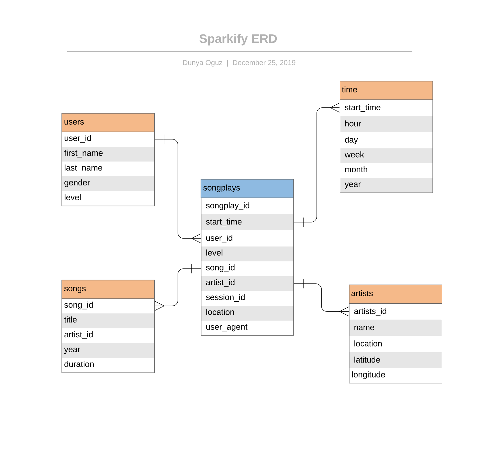

# sparkify_data_modelling

## Project Summary
In this project, I build a database schema and an ETL pipeline for a music streaming app called Sparkify. 

We start with two categories of data: song data and log data. Song data is the metadata we have on artists and songs, such as artist name, artist country, song title, song duration, etc. Log data is the event logs on user activity coming from the app, such as which song a particular user listened to. 

### Project Components: 
1) Creating the data model: The data model follows a star schema, consisting of one fact table (songplays) and four dimension tables (users, songs, time, artists), as shown in the ERD below. It is optimized for queries on song play analysis. 

2) Building the ETL pipeline: The ETL process consists of extracting files residing in local directories, transforming the data from JSON into pandas dataframes and loading them onto a local postgres instance. 

### Directory
* `create_tables.py`: Spins up a local postgres database called sparkifydb and creates the tables in the schema
* `sql_queries.py`: Contains all the queries used to create, drop and insert data into our tables 
* `test.ipnyb`: Used to test whether our database operations worked successfully 
* `etl.ipnyb`: ETL done only on one file from each of data repositories. This sectiom is mainly for exploring and testing before fully automating the ETL 
* `etl.py`: Processes the entirety of log and song data

### Want to run these scripts on your own machine? 

- `git clone https://github.com/dunyaoguz/sparkify_data_modelling` 
- `cd sparkify_data_modelling` 
- `brew install postgres` (if not already installed)
- `pip install psycopg2` & `pip install psycopg2-binary` (if not already installed)
- Replace the username argument in the postgres connection string with your own username (`create_tables.py`: line 7 and line 19, `test.ipnyb`: line 2, `etl.ipnyb`: line 8, `etl.py`: line 98) 
- `python create_tables.py`
- `python etl.py` 

### Tech Stack:
* glob
* psycopg2
* postgres
* pandas
* json
* os
